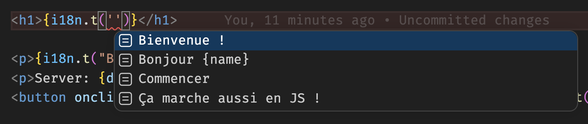

# @les3dev/i18n

Type-safe internationalization library for JavaScript and Svelte 5 with full TypeScript support.



## Features

- **Type-safe translations** — Full TypeScript inference for translation keys and arguments
- **Parameterized translations** — Support for functions with typed arguments
- **Framework agnostic** — Works with any JavaScript project, with optional Svelte 5 integration
- **Automatic locale detection** — Built-in Accept-Language header parsing
- **Lightweight** — No dependencies, small bundle size

## Installation

```bash
npm install @les3dev/i18n
```

For Svelte 5 support:

```bash
npm install @les3dev/i18n svelte@^5
```

## Basic Usage (JavaScript/TypeScript)

### 1. Define Your Translations

Create translation files for each locale:

```typescript
// translations/fr.ts
import type {DefaultTranslation} from "@les3dev/i18n";

export default {
    "Bienvenue !": "Bienvenue !",
    Commencer: "Commencer",
    "Bonjour {name}": (name: string) => `Bonjour ${name}`,
    "Ça marche aussi en JS !": "Ça marche aussi en JS !",
} satisfies DefaultTranslation;
```

```typescript
// translations/en.ts
import type {Translation} from "..";

export default {
    "Bienvenue !": "Welcome!",
    Commencer: "Start",
    "Bonjour {name}": (name: string) => `Hello ${name}`,
    "Ça marche aussi en JS !": "Also works in js!",
} satisfies Translation;
```

### 2. Register Translations

```typescript
import {register_translations, type I18n} from "@les3dev/i18n";
import fr from "./translations/fr";
import en from "./translations/en";

export const i18n: I18n<"fr" | "en", typeof fr> = register_translations({fr, en}, "fr");
export const {translate} = i18n;

export type Locale = Parameters<typeof translate>[0];
export type Translation = typeof fr;
```

> **Note:** The explicit `I18n` type annotation is required for monorepo compatibility. Without it, bundlers like Rollup may fail to generate portable type declarations.

### 3. Automatic Locale Detection

```typescript
import {get_locale_from_headers} from "@les3dev/i18n";

// Detect locale from Accept-Language header
const locale = get_locale_from_headers(request.headers, i18n);
const greeting = i18n.translate(locale, "greeting");
```

## Svelte 5 Integration

For Svelte 5 projects, use the `create_i18n_context` helper to manage translations reactively.

> See sveltekit-example for a fully working example

### 1. Create Context File

```typescript
// src/lib/i18n/context.svelte.ts
import {create_i18n_context} from "@les3dev/i18n/svelte";
import {i18n} from "./index";

export const {get_i18n_context, set_i18n_context} = create_i18n_context(i18n);
```

### 2. Initialize in Layout

```svelte
<!-- src/routes/+layout.svelte -->
<script lang="ts">
    import { set_i18n_context } from "$lib/i18n/context.svelte";

    let { children } = $props();

    // Initialize with locale from server (cookie, URL, etc.)
    set_i18n_context(() => data.locale);
</script>

{@render children()}
```

### 3. Use in Components

```svelte
<!-- src/routes/+page.svelte -->
<script lang="ts">
    import { get_i18n_context } from "$lib/i18n/context.svelte";

    const i18n = get_i18n_context();
</script>

<h1>{i18n.t("greeting")}</h1>
<p>{i18n.t("greet", "Alice")}</p>

<!-- Change locale -->
<select bind:value={i18n.locale}>
    <option value="fr">Français</option>
    <option value="en">English</option>
</select>
```

## SvelteKit Full Example

### Project Structure

```
src/
├── lib/
│   └── i18n/
│       ├── index.ts           # register_translations setup
│       ├── context.svelte.ts  # Svelte context helpers
│       └── translations/
│           ├── fr.ts
│           └── en.ts
├── routes/
│   ├── +layout.svelte
│   ├── +layout.server.ts      # Pass locale to client
│   ├── +page.svelte
│   └── +page.server.ts
├── hooks.server.ts            # Locale detection
└── app.d.ts                  # Type declarations
```

### Setup Files

```typescript
// src/lib/i18n/index.ts
import {register_translations, type I18n} from "@les3dev/i18n";
import fr from "./translations/fr";
import en from "./translations/en";

export const i18n: I18n<"fr" | "en", typeof fr> = register_translations({fr, en}, "fr");
export const {translate, locales, default_locale} = i18n;

export type Locale = Parameters<typeof translate>[0];
```

```typescript
// src/lib/i18n/context.svelte.ts
import {create_i18n_context} from "@les3dev/i18n/svelte";
import {i18n} from "./index";

export const {get_i18n_context, set_i18n_context} = create_i18n_context(i18n);
```

```typescript
// src/app.d.ts
import type {TranslateFn} from "@les3dev/i18n";
import {i18n} from "$lib/i18n";

declare global {
    namespace App {
        interface Locals {
            locale: "fr" | "en";
            translate: TranslateFn<typeof i18n>;
        }
    }
}

export {};
```

```typescript
// src/hooks.server.ts
import {i18n} from "$lib/i18n";
import {get_locale_from_headers} from "@les3dev/i18n";
import type {Handle} from "@sveltejs/kit";

export const handle: Handle = async ({event, resolve}) => {
    // Check cookie first, then Accept-Language header
    const cookieLocale = event.cookies.get("locale");

    if (cookieLocale && i18n.locales.includes(cookieLocale as (typeof i18n.locales)[number])) {
        event.locals.locale = cookieLocale as "fr" | "en";
    } else {
        event.locals.locale = get_locale_from_headers(event.request.headers, i18n);
    }

    event.locals.translate = (key, ...args) => i18n.translate(event.locals.locale, key, ...args);

    return resolve(event);
};
```

```typescript
// src/routes/+layout.server.ts
import type {LayoutServerLoad} from "./$types";

export const load: LayoutServerLoad = ({locals}) => {
    return {
        locale: locals.locale,
    };
};
```

```svelte
<!-- src/routes/+layout.svelte -->
<script lang="ts">
    import { set_i18n_context } from "$lib/i18n/context.svelte";

    let { data, children } = $props();

    set_i18n_context(() => data.locale);
</script>

{@render children()}
```

```svelte
<!-- src/routes/+page.svelte -->
<script lang="ts">
    import { get_i18n_context } from "$lib/i18n/context.svelte";

    const i18n = get_i18n_context();
</script>

<h1>{i18n.t("welcome")}</h1>
<p>{i18n.t("greet", "World")}</p>
```

```typescript
// src/routes/+page.server.ts
import type {PageServerLoad, Actions} from "./$types";
import {redirect} from "@sveltejs/kit";

export const load: PageServerLoad = ({locals}) => {
    return {
        greeting: locals.translate("greeting"),
    };
};

export const actions: Actions = {
    setLocale: async ({request, cookies}) => {
        const formData = await request.formData();
        const locale = formData.get("locale") as string;

        cookies.set("locale", locale, {
            path: "/",
            maxAge: 60 * 60 * 24 * 365,
        });

        redirect(303, request.url);
    },
};
```

```svelte
<!-- src/routes/+page.svelte -->
<script lang="ts">
    import { get_i18n_context } from "$lib/i18n/context.svelte";

    let { data } = $props();
    const i18n = get_i18n_context();
</script>

<h1>{i18n.t("welcome")}</h1>
<p>{i18n.t("greet", "World")}</p>

<form method="POST" action="?/setLocale">
    <select name="locale" onchange={(e) => {
        const form = e.currentTarget.form;
        if (form) form.requestSubmit();
    }}>
        <option value="fr" selected={i18n.locale === "fr"}>Français</option>
        <option value="en" selected={i18n.locale === "en"}>English</option>
    </select>
</form>
```

## Type Safety

The library provides full TypeScript inference:

```typescript
// Translation keys are inferred
i18n.translate("en", "greeting"); // OK
i18n.translate("en", "invalid"); // Error: doesn't exist

// Function arguments are type-checked
i18n.translate("en", "greet"); // Error: missing argument
i18n.translate("en", "greet", "Alice"); // OK
i18n.translate("en", "greet", 123); // Error: wrong type
```

## License

MIT
